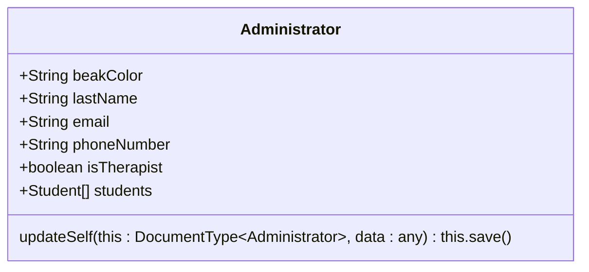
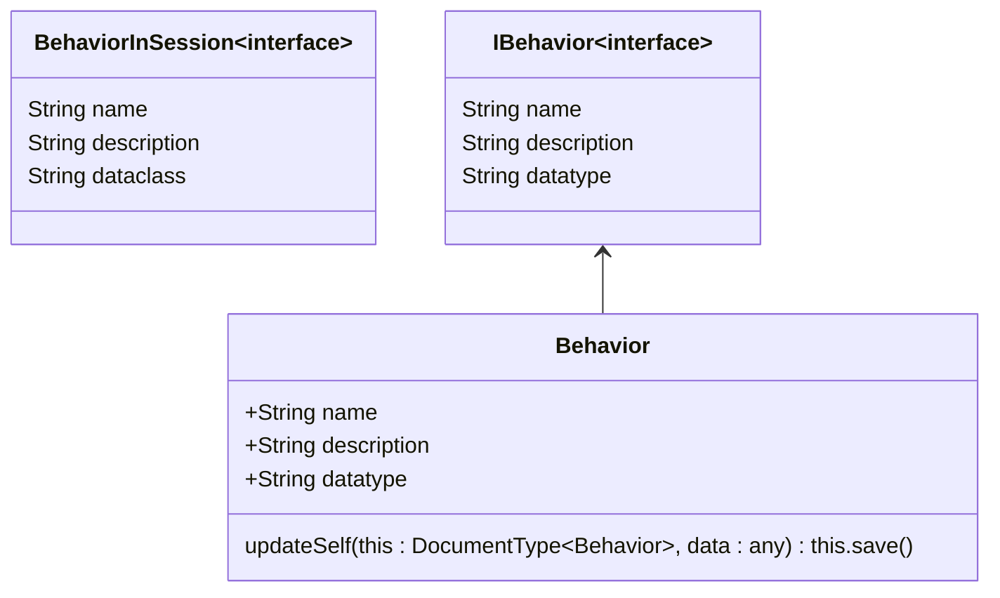
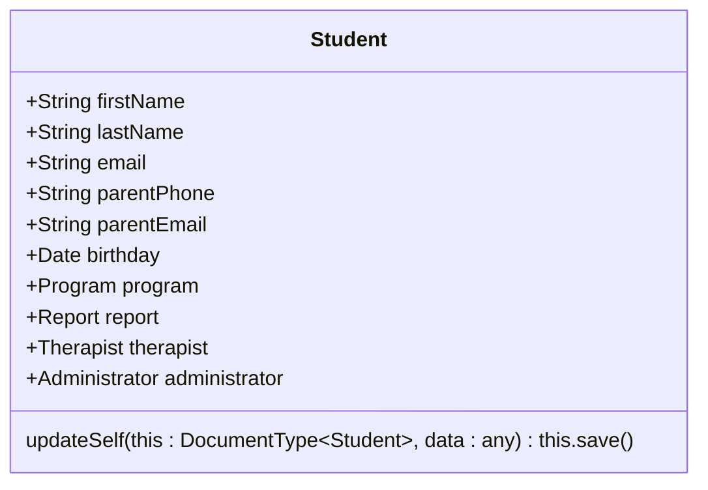
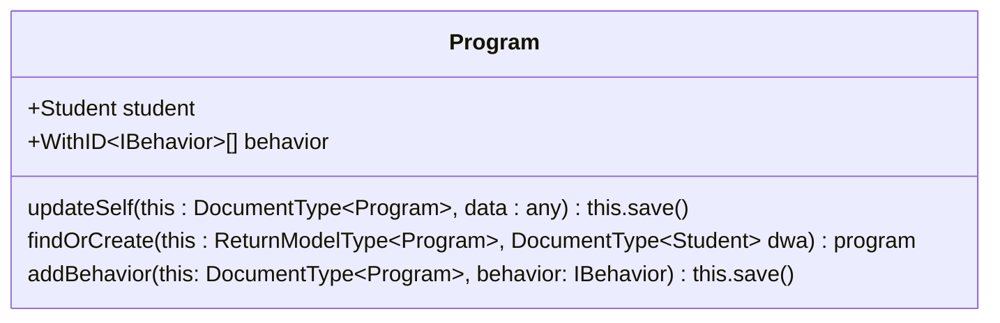
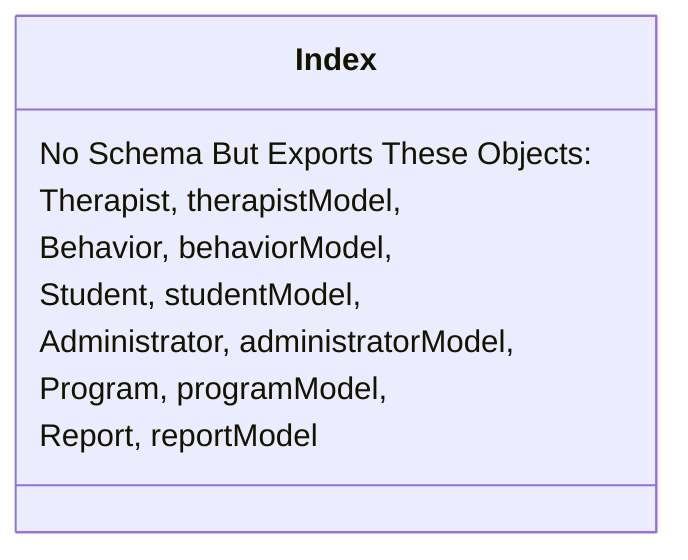
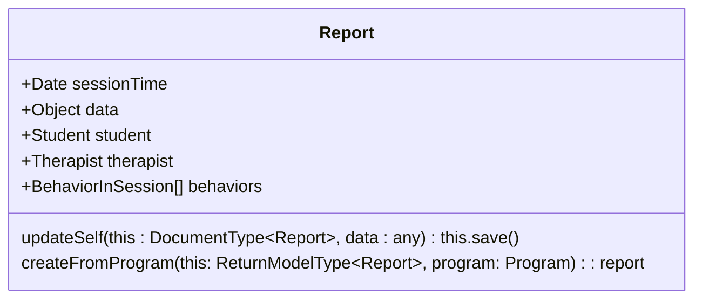

## Schemas
The following Mongoose schemas are defined in `./models/schema_name.ts`

```mermaid
classDiagram
    class Administrator {
        +String beakColor
        +String lastName
        +String email
        +String phoneNumber
        +boolean isTherapist
        +Student[] students

        updateSelf(this : DocumentType~Administrator~, data : any) : this.save()
    }
```
  

```mermaid
classDiagram
    class BehaviorInSession~interface~{
        String name
        String description
        String dataclass
    }

    class IBehavior~interface~{
        String name
        String description
        String datatype
    }

    class Behavior {
        +String name
        +String description
        +String datatype

        updateSelf(this : DocumentType~Behavior~, data : any) : this.save()
    }

    IBehavior <-- Behavior
```

  

```mermaid
classDiagram
    class Student {
        +String firstName
        +String lastName
        +String email
        +String parentPhone
        +String parentEmail
        +Date birthday

        +Program program
        +Report report
        +Therapist therapist
        +Administrator administrator

        updateSelf(this : DocumentType~Student~, data : any) : this.save()
    }
```

  

```mermaid
classDiagram
    class Program {
        +Student student
        +WithID~IBehavior~[] behavior

        updateSelf(this : DocumentType~Program~, data : any) : this.save()
        findOrCreate(this : ReturnModelType~Program~, DocumentType~Student~ dwa) program
        addBehavior(this: DocumentType~Program~, behavior: IBehavior) : this.save()
    }
```

  

```mermaid
classDiagram
    class Index {
        No Schema But Exports These Objects:
        Therapist, therapistModel,
        Behavior, behaviorModel,
        Student, studentModel,
        Administrator, administratorModel,
        Program, programModel,
        Report, reportModel
    }
```

  

```mermaid
classDiagram
    class Report {
        +Date sessionTime
        +Object data
        +Student student
        +Therapist therapist
        +BehaviorInSession[] behaviors

        updateSelf(this : DocumentType~Report~, data : any) : this.save()
        createFromProgram(this: ReturnModelType~Report~, program: Program) : report
    }
```

  
