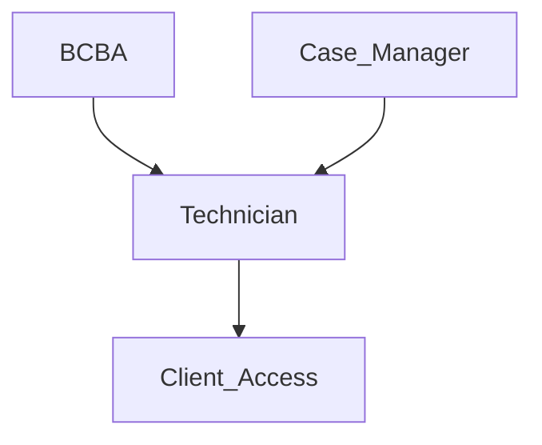

# ATC Student Database
## Main Functionality
ATC calls patients "students" and we will be referring to them as such. This is a database in the works for the Autism Treatment Center. It should store data about students, the technicians, parents, and doctors who are involved with said student. There needs to be roles that have certain permissisions depending on what they are. 
### Current Functionalities
#### Note: The folder named analytics is currently useless and doesn't have a function, but Taz says to keep it just in case the idea of the code becomes useful later on. None of the new client side data fetching code has been fully tested due to the fact that the *search functionality doesn't work* to begin with. 
* Ideal functional requirements for the app are accessibility on Android and Mac Operating System.
* There has to be a login page that connects to Auth0. As of now, a developer will be able to sign in/create an account using Google, assuming that they have the Authorization key provided by the instructor. It will be the first thing you see when you open the link provided in the terminal ([auth0].tsx). 
* Upon logging in, you are instantly taken to the **Student Search** Page. From this page, you can **add**, **edit**, view existing **profiles**, and **search** for students (Found in ATC-Patient-Data\pages\student\search.tsx).
  * Pressing the **ADD NEW** button will result in going to a new page where you can create a new Student component/object with information tied to said objects (ATC-Patient-Data\pages\student\new.tsx).
    * Basic Student information would need to be added such as name, date of birth, diagnosis, any restrictions such as dietary, movement, etc., funding source, and supervising BCBA would need to be added. 
  * Pressing the **EDIT** button will result in going to a new page where you can edit existing information about a Student that already exists (ATC-Patient-Data\pages\student\edit.tsx).
  * Clicking on a profile link will take you to a page that displays all existing information about said Student and should allow new therapy session objects to be created (ATC-Patient-Data\pages\student\profile.tsx).
* You can also click on **Manage Behaviors** to take you to the Behaviors page, which will allow you to **add** and **manage** behaviors that can be mastered by the Student (like not biting people).
  * The app should be able to have a queue of targets for each goal that BCBAs can add per student.
  * Pressing the **ADD BEHAVIOR** button will take you to the Add Behavior page where the name, description, and type can be strung along with the created Behavior component (ATC-Patient-Data\pages\behaviors\add.tsx).
  * Clicking on a behavior link will take you to a page that should allow you to view or edit existing behaviors, depending on the user role (ATC-Patient-Data\pages\behaviors\manage.tsx).
* The other tab in the first page of the application is the **Employee Search**. It should allow an *Admin Only* to search for employees and information about said employees (ATC-Patient-Data\pages\employees\search.tsx).
   * Pressing the **ADD NEW** button will result in going to a new page where you can create a new Employee object/component with information tied to each Employee (ATC-Patient-Data\pages\employees\new.tsx).
   * Pressing the **EDIT** button will result in going to a new page where you can edit an existing Employee's information (ATC-Patient-Data\pages\employees\edit.tsx).
   * Clicking on an Employee component should take you to a page that displays all information stored in the employee object (ATC-Patient-Data\pages\employees\profile.tsx).
* It also needs to be able to list goals that are added by BCBAs and provide RBTs with the ability to take data on those goals that directly reflect the mastery criteria ***[PAGES TO BE ADDED WHEN ANUSHA'S PR GOES THROUGH]***
   * Mastery criteria is basically the required behaviors a student needs to exhibit to "master" a behavior. It can be something like "'Biting people' can be mastered when this behavior has not been exhibited for 2 months staight." Once a behavior is mastered, it can be considered "done" and the next behavior can be focused on. 

### Required Functionalities
#### Note: These functions don't have pages attached to them because as of 12/9/2023, the document managers have not been able to find proof of these existing within a given page or they just haven't been fully implemented yet. They have been requested by the client this semester. 
**<ins>User Types</ins>**
* BCBA- Essentially the doctors in charge of the operation. They have admin access.
* Case Manager- Masters-level employees of ATC, but are not doctorates yet. Also admin access.
* Technician- The therapists. The only thing they can do is create new session data and look at behaviors of the students they are working with. Everything else is irrelevant.
* Client- Can be either a parent or the student themself. They have read-only access to all information under their name, but ONLY under their own name. Remember that if the client is a child, the parent excises the HIPAA rights regarding the student. 

* Different RBTs (Technicians; essentially therapy drones under the control of the BCBA) should be able to document the times that they saw a certain client and write a note about their session with that client. At the end of the client's therapy, all therapy notes from all of the RBTs that worked with a client would be put together with the times that the client was seen to give an overall report of the client's therapy session for that day. For example, if a client comes to therapy for a total of 3 hours but had 2 different RBTs, both RBT's would need a note from their session along with the times that they saw that client.
* At the end of the 3 hour session, the app would put together the data that was collected and the therapy notes from each RBT and consolidate it into a single report to send to the funding source. Ideally, it's downloadable to a .pdf format to be sent manually by a BCBA.
* Should take the data that was recorded and graph it on a line graph showing progress over time (behaviors mastered over time).
* Autosave every couple of seconds when a technician, case manager, or BCA is entering session data. 

## Client Information
* Autism Treatment Center offers medical, behavioral, and cognitive services catered to children and adults on the spectrum.
* For information about Doctor Marilyn Reid, follow [this link](https://docs.google.com/document/d/126QVnrknU_OxzyC2Bezswwdcqsd5Gp76r7fUEmXEGME/edit?usp=sharing)

## Third Party Integrations
### Auth0
* Auth0 stores our user data. The idea of Auth0 is that it checks if who's attempting to log in is who they say they are.
* If the user information sent to Auth0 doesn't match the Auth0's database, the connection is killed.
* If the user information stored in Auth0 doesn't match what's inside the database, the database rejects the connection.

## Getting Started
Before anything, read last semester's final report in Edusouced, read everything in the [documentation](https://github.com/UTDallasEPICS/ATC-Patient-Management-Backend/tree/main/Documentation), and everything in the [wiki](https://github.com/UTDallasEPICS/ATC-Patient-Management-Frontend/wiki).
When creating code, please use comments as you write; it helps during and after writing (but don't clutter the code!). The most important comments are the ones that explain design decisions. 
Before attempting to run the website, please visit [the prerequisites file:](https://github.com/UTDallasEPICS/ATC-Patient-Data/blob/Docu_Cleaning/Documentation/Start%20from%20Scratch.md)

## Run Web Application
1. `cd ATC-Patient-Data`
    * > If this doesn't take you to the local repo, use `cd` to make the terminal look at `ATC-Patient-Data` through the file path
3. run `npm run dev` to start the website
    * > NOTE: Docker should be running if you are developing
4. go to `http://localhost:3000` in your console to see the app
  
## Learn More

### Promises/async/await
* https://javascript.info/async    
 * go through from 1 to 8
### fetch() 
* https://developer.mozilla.org/en-US/docs/Web/API/fetch
### API Route 
* https://nextjs.org/docs/pages/building-your-application/routing/api-routes
### Server Side Data Fetching 
* https://nextjs.org/docs/pages/building-your-application/data-fetching/get-server-side-props
### Client Side Data Fetching 
* https://nextjs.org/docs/pages/building-your-application/data-fetching/client-side
### Prisma with Next.js 
* https://www.prisma.io/docs/reference/api-reference/prisma-client-reference
### Destructing Props (properties)
* https://medium.com/@lcriswell/destructuring-props-in-react-b1c295005ce0
### useUser 
* https://auth0.github.io/nextjs-auth0/functions/client_use_user.useUser.html
 * Auth0 and role permission related
### use Functions 
* https://youtu.be/TNhaISOUy6Q?si=vQNsKWl_1aZlGxhM
### useEffect (MUST READ IF YOU ARE WORKING ON CLIENT SIDE DATA FETCHING) 
* https://youtu.be/0ZJgIjIuY7U?si=-mrezPqGnbbstYAx
### useRouter 
* https://nextjs.org/docs/pages/api-reference/functions/use-router#router-object
